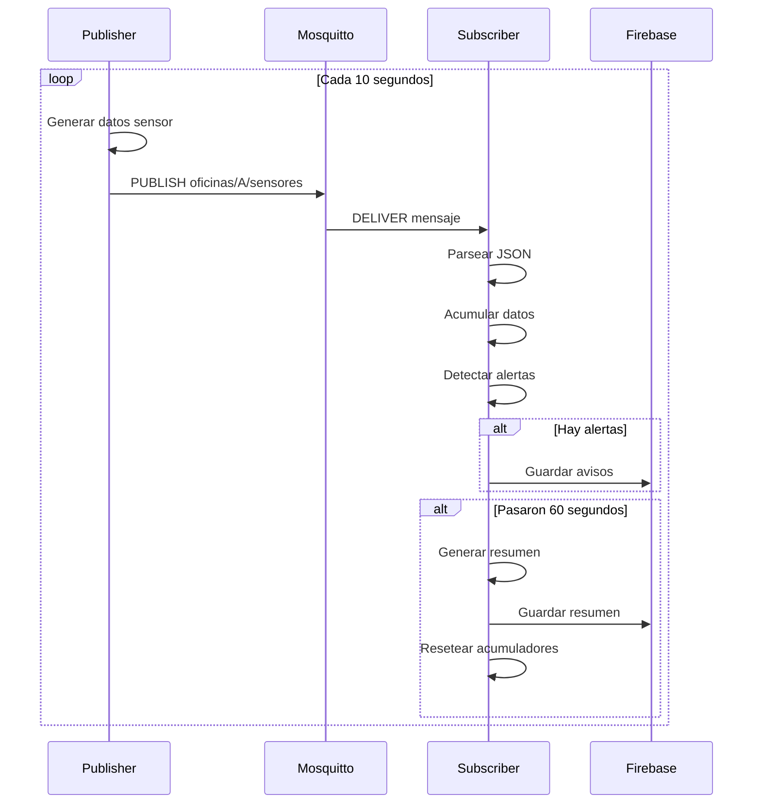

# API MQTT

El sistema utiliza **MQTT** (Message Queuing Telemetry Transport) para la comunicación entre sensores simulados y el procesador de eventos.

## Broker MQTT

**Implementación**: Mosquitto  
**Puerto**: 1883  
**Protocolo**: MQTT v3.1.1  
**Autenticación**: Anónima (desarrollo)

## Estructura de Tópicos

### Patrón de Tópicos

```
oficinas/{id}/sensores
```

**Ejemplos**:
- `oficinas/A/sensores`
- `oficinas/B/sensores`
- `oficinas/C/sensores`

### Wildcard Subscriptions

El Subscriber usa wildcards para escuchar todas las oficinas:

```
oficinas/+/sensores
```

Donde `+` coincide con cualquier ID de oficina.

## Formato de Mensajes

### Mensaje de Sensor

```json
{
  "oficina": "A",
  "timestamp": 1701648000,
  "presencia": true,
  "corriente_a": 12.5,
  "temperatura": 24.3
}
```

#### Estructura de Datos

| Campo | Tipo | Descripción | Rango |
|-------|------|-------------|-------|
| `oficina` | string | ID de la oficina | A-Z, 0-9 |
| `timestamp` | number | Unix timestamp (segundos) | - |
| `presencia` | boolean | Detección de presencia | true/false |
| `corriente_a` | number | Corriente eléctrica (Amperes) | 0.0 - 50.0 |
| `temperatura` | number | Temperatura ambiente (°C) | 15.0 - 35.0 |

## Publisher (Go)

### Configuración

```go
opciones := mqtt.NewClientOptions().
    AddBroker("tcp://localhost:1883").
    SetClientID("publicador-sensores")

clienteMQTT := mqtt.NewClient(opciones)
if token := clienteMQTT.Connect(); token.Wait() && token.Error() != nil {
    panic(token.Error())
}
```

### Publicar Mensaje

```go
func SimularYPublicar(cliente mqtt.Client, oficina string) {
    ahora := time.Now()
    timestamp := ahora.Unix()
    
    presencia := DetectarPresencia(ahora)
    temperatura := CalcularSiguienteTemperatura(ultimaTemperatura[oficina])
    corriente := 0.0
    
    if presencia {
        corriente = CalcularCorriente(oficina, presencia, temperatura)
    }
    
    datos := DatosSensor{
        Oficina:     oficina,
        TiempoUnix:  timestamp,
        Presencia:   presencia,
        CorrienteA:  corriente,
        Temperatura: temperatura,
    }
    
    payload, _ := json.Marshal(datos)
    topico := fmt.Sprintf("oficinas/%s/sensores", oficina)
    
    token := cliente.Publish(topico, 0, false, payload)
    token.Wait()
}
```

### QoS (Quality of Service)

El Publisher usa **QoS 0** (At most once):
- No confirmación de entrega
- Menor overhead
- Adecuado para datos en tiempo real donde la pérdida ocasional es aceptable

### Frecuencia de Publicación

```go
temporizador := time.NewTicker(10 * time.Second)
defer temporizador.Stop()

for range temporizador.C {
    for _, oficina := range oficinas {
        SimularYPublicar(clienteMQTT, oficina)
    }
}
```

**Intervalo**: 10 segundos por oficina

## Subscriber (Go)

### Configuración

```go
opciones := mqtt.NewClientOptions().
    AddBroker("tcp://localhost:1883").
    SetClientID("subscriptor-edge")

clienteMQTT := mqtt.NewClient(opciones)
if token := clienteMQTT.Connect(); token.Wait() && token.Error() != nil {
    panic(token.Error())
}
```

### Suscribirse a Tópicos

```go
topic := "oficinas/+/sensores"

clienteMQTT.Subscribe(topic, 0, func(_ mqtt.Client, msg mqtt.Message) {
    var datos DatosSensor
    if err := json.Unmarshal(msg.Payload(), &datos); err != nil {
        return
    }
    
    // Procesar datos
    estado := obtenerEstado(datos.Oficina)
    estado.Mutex.Lock()
    defer estado.Mutex.Unlock()
    
    // Acumular datos
    estado.Corrientes = append(estado.Corrientes, datos.CorrienteA)
    estado.Temperaturas = append(estado.Temperaturas, datos.Temperatura)
    
    if datos.Presencia {
        estado.TiempoPresente += 10
    }
    
    // Detectar alertas
    avisos := detectarAvisos(datos, estado)
    for _, av := range avisos {
        guardarAviso(ctx, datos.Oficina, av)
    }
    
    // Generar resumen cada 60 segundos
    if ahora - estado.UltimoResumen >= 60 {
        resumen := generarResumen(ahora, estado)
        guardarResumen(ctx, datos.Oficina, resumen)
        
        // Resetear acumuladores
        estado.Corrientes = nil
        estado.Temperaturas = nil
        estado.TiempoPresente = 0
    }
})
```

## Flujo de Mensajes



## Ejemplo de Cliente Python

```python
import paho.mqtt.client as mqtt
import json
import time

def on_connect(client, userdata, flags, rc):
    print(f"Conectado con código: {rc}")
    client.subscribe("oficinas/+/sensores")

def on_message(client, userdata, msg):
    datos = json.loads(msg.payload.decode())
    print(f"Oficina {datos['oficina']}: {datos['corriente_a']}A, {datos['temperatura']}°C")

client = mqtt.Client()
client.on_connect = on_connect
client.on_message = on_message

client.connect("localhost", 1883, 60)
client.loop_forever()
```

## Ejemplo de Cliente JavaScript (Node.js)

```javascript
const mqtt = require('mqtt');

const client = mqtt.connect('mqtt://localhost:1883', {
    clientId: 'cliente-js-' + Math.random().toString(16).substr(2, 8)
});

client.on('connect', () => {
    console.log('Conectado a MQTT');
    client.subscribe('oficinas/+/sensores', (err) => {
        if (!err) {
            console.log('Suscrito a sensores');
        }
    });
});

client.on('message', (topic, message) => {
    const datos = JSON.parse(message.toString());
    console.log(`${topic}:`, datos);
});
```

## Publicar Mensaje de Prueba

### Usando mosquitto_pub

```bash
mosquitto_pub -h localhost -t "oficinas/TEST/sensores" -m '{
  "oficina": "TEST",
  "timestamp": 1701648000,
  "presencia": true,
  "corriente_a": 15.5,
  "temperatura": 23.8
}'
```

### Usando MQTT.fx (GUI)

1. Conectar a `localhost:1883`
2. Ir a pestaña "Publish"
3. Topic: `oficinas/TEST/sensores`
4. Payload: JSON del mensaje
5. Click "Publish"

## Monitoreo de Tópicos

### Suscribirse a Todos los Mensajes

```bash
mosquitto_sub -h localhost -t "oficinas/#" -v
```

Salida:
```
oficinas/A/sensores {"oficina":"A","timestamp":1701648000,...}
oficinas/B/sensores {"oficina":"B","timestamp":1701648010,...}
oficinas/C/sensores {"oficina":"C","timestamp":1701648020,...}
```

### Filtrar por Oficina Específica

```bash
mosquitto_sub -h localhost -t "oficinas/A/sensores" -v
```

## Configuración de Mosquitto

### Archivo de Configuración

`config/mosquitto.conf`:

```conf
# Puerto de escucha
listener 1883

# Permitir conexiones anónimas (solo desarrollo)
allow_anonymous true

# Logs
log_dest file logs/mosquitto.log
log_type all

# Persistencia
persistence true
persistence_location data/mosquitto/

# Límites
max_connections 100
max_queued_messages 1000
max_packet_size 104857600
```

### Iniciar Mosquitto

```bash
mosquitto -c config/mosquitto.conf -v
```

## Seguridad (Producción)

Para producción, configura autenticación:

### Crear Archivo de Contraseñas

```bash
mosquitto_passwd -c config/passwd usuario1
# Ingresa contraseña cuando se solicite
```

### Actualizar Configuración

```conf
listener 1883
allow_anonymous false
password_file config/passwd
```

### Conectar con Autenticación

```go
opciones := mqtt.NewClientOptions().
    AddBroker("tcp://localhost:1883").
    SetClientID("publicador-sensores").
    SetUsername("usuario1").
    SetPassword("contraseña")
```

## Troubleshooting

### Verificar Conexión

```bash
# Ping al broker
mosquitto_pub -h localhost -t "test" -m "ping"
mosquitto_sub -h localhost -t "test"
```

### Ver Mensajes en Tiempo Real

```bash
# Terminal 1: Suscribirse
mosquitto_sub -h localhost -t "oficinas/#" -v

# Terminal 2: Publicar
mosquitto_pub -h localhost -t "oficinas/A/sensores" -m '{"test":true}'
```

### Logs del Broker

```bash
tail -f logs/mosquitto.log
```

---

<div class="tip custom-block">
  <p class="custom-block-title"><i class="fas fa-lightbulb"></i> Consejo</p>
  <p>Usa herramientas como <strong>MQTT Explorer</strong> o <strong>MQTT.fx</strong> para visualizar y depurar mensajes MQTT de forma gráfica.</p>
</div>
