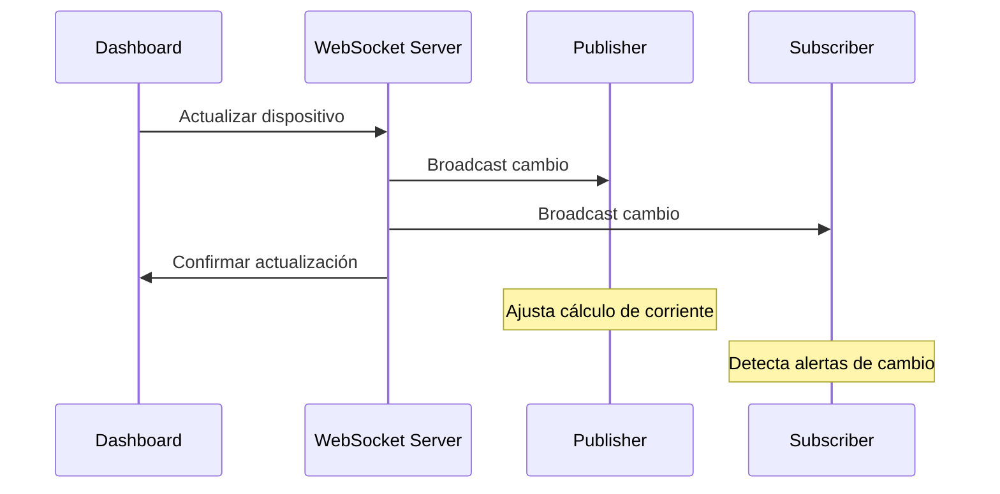

# API WebSocket

El sistema utiliza **WebSocket** para comunicación bidireccional en tiempo real entre el servidor y los clientes (dashboard).

## Servidor WebSocket

**URL Base**: `ws://localhost:8081`

**Puerto**: 8081

## Endpoints Disponibles

### 1. `/ws/resumenes`

Transmite resúmenes de consumo de todas las oficinas.

#### Conexión

```javascript
const ws = new WebSocket('ws://localhost:8081/ws/resumenes');

ws.onopen = () => {
    console.log('Conectado a resumenes');
};

ws.onmessage = (event) => {
    const data = JSON.parse(event.data);
    console.log('Resumen recibido:', data);
};
```

#### Mensaje Recibido

```json
{
  "tipo": "resumenes",
  "data": {
    "A": {
      "timestamp": 1701648000,
      "corriente_a": 12.5,
      "consumo_kvh": 2.75,
      "consumo_total_kvh": 45.6,
      "min_temp": 22.5,
      "max_temp": 25.8,
      "tiempo_presente": 300,
      "monto_estimado": 0.69,
      "monto_total": 11.4
    },
    "B": {
      "timestamp": 1701648000,
      "corriente_a": 8.2,
      "consumo_kvh": 1.80,
      "consumo_total_kvh": 33.6,
      "min_temp": 23.1,
      "max_temp": 26.2,
      "tiempo_presente": 240,
      "monto_estimado": 0.45,
      "monto_total": 8.4
    }
  }
}
```

#### Estructura de Datos

| Campo | Tipo | Descripción |
|-------|------|-------------|
| `timestamp` | number | Unix timestamp del resumen |
| `corriente_a` | number | Corriente promedio (Amperes) |
| `consumo_kvh` | number | Consumo del período actual (kWh) |
| `consumo_total_kvh` | number | Consumo total acumulado (kWh) |
| `min_temp` | number | Temperatura mínima (°C) |
| `max_temp` | number | Temperatura máxima (°C) |
| `tiempo_presente` | number | Tiempo con presencia (segundos) |
| `monto_estimado` | number | Costo del período actual |
| `monto_total` | number | Costo total acumulado |

#### Frecuencia

- **Inicial**: Al conectar, envía datos actuales
- **Actualizaciones**: Cada 10 segundos

---

### 2. `/ws/avisos`

Transmite alertas y notificaciones del sistema.

#### Conexión

```javascript
const ws = new WebSocket('ws://localhost:8081/ws/avisos');

ws.onmessage = (event) => {
    const data = JSON.parse(event.data);
    data.data.forEach(aviso => {
        mostrarAlerta(aviso);
    });
};
```

#### Mensaje Recibido

```json
{
  "tipo": "avisos",
  "data": [
    {
      "timestamp": 1701648000,
      "id_tipo": "1",
      "adicional": "Oficina A - Luces encendidas por detección de presencia"
    },
    {
      "timestamp": 1701648060,
      "id_tipo": "4",
      "adicional": "Oficina C - Aire acondicionado activado por temperatura elevada (25.8°C)"
    }
  ]
}
```

#### Tipos de Avisos

| ID | Motivo | Detalle | Impacto |
|----|--------|---------|---------|
| 0 | Luces apagadas | Estado desactivado | 2 |
| 1 | Luces encendidas | Detección de presencia | 1 |
| 2 | Luces apagadas | Ausencia detectada | 2 |
| 3 | Aire apagado | Estado desactivado | 2 |
| 4 | Aire encendido | Temperatura elevada con presencia | 3 |
| 5 | Aire apagado | Condiciones óptimas | 2 |
| 6 | Consumo anómalo | Corriente alta sin presencia | 3 |
| 7 | Corte de energía | Corriente en 0 por corte | 3 |
| 8 | Sensor no responde | Sin datos por >60s | 3 |
| 9 | Alerta de corriente | Consumo > umbral | 3 |
| 10 | Oficina agregada | Nueva oficina | 1 |
| 11 | Oficina eliminada | Oficina removida | 1 |
| 12 | Config modificada | Parámetros cambiados | 1 |

---

### 3. `/ws/dispositivos`

Gestiona el estado de dispositivos (luces, aire acondicionado).

#### Conexión

```javascript
const ws = new WebSocket('ws://localhost:8081/ws/dispositivos');

// Recibir estado
ws.onmessage = (event) => {
    const data = JSON.parse(event.data);
    actualizarUI(data.data);
};
```

#### Mensaje Recibido

```json
{
  "tipo": "dispositivos",
  "data": {
    "A": { "aire": true, "luces": true },
    "B": { "aire": false, "luces": true },
    "C": { "aire": true, "luces": false }
  }
}
```

#### Enviar Actualización

```javascript
// Cambiar estado de un dispositivo
ws.send(JSON.stringify({
    tipo: 'actualizar_dispositivo',
    oficina: 'A',
    dispositivo: 'luces',  // 'luces' o 'aire'
    estado: false
}));
```

#### Flujo de Actualización



---

### 4. `/ws/params`

Gestiona parámetros de configuración del sistema.

#### Conexión

```javascript
const ws = new WebSocket('ws://localhost:8081/ws/params');

// Recibir configuración
ws.onmessage = (event) => {
    const data = JSON.parse(event.data);
    cargarConfiguracion(data.data);
};
```

#### Mensaje Recibido

```json
{
  "tipo": "params",
  "data": {
    "hora_inicio": 8.0,
    "hora_fin": 20.0,
    "umbral_temperatura_ac": 25.0,
    "umbral_corriente": 21.5,
    "voltaje": 220.0,
    "costo_kwh": 0.25
  }
}
```

#### Enviar Actualización

```javascript
ws.send(JSON.stringify({
    tipo: 'actualizar_params',
    data: {
        hora_inicio: 9.0,
        hora_fin: 18.0,
        umbral_temperatura_ac: 24.0,
        umbral_corriente: 20.0,
        voltaje: 220.0,
        costo_kwh: 0.30
    }
}));
```

#### Parámetros

| Campo | Tipo | Descripción | Rango |
|-------|------|-------------|-------|
| `hora_inicio` | number | Hora de inicio (formato 24h) | 0.0 - 23.99 |
| `hora_fin` | number | Hora de fin (formato 24h) | 0.0 - 23.99 |
| `umbral_temperatura_ac` | number | Temperatura para activar AC (°C) | 15.0 - 35.0 |
| `umbral_corriente` | number | Umbral de alerta (Amperes) | 5.0 - 50.0 |
| `voltaje` | number | Voltaje de red (V) | 110 / 220 |
| `costo_kwh` | number | Costo por kWh | 0.01 - 10.0 |

---

### 5. `/ws/oficinas`

Gestiona la lista de oficinas monitoreadas.

#### Conexión

```javascript
const ws = new WebSocket('ws://localhost:8081/ws/oficinas');

ws.onmessage = (event) => {
    const data = JSON.parse(event.data);
    actualizarListaOficinas(data.data);
};
```

#### Mensaje Recibido

```json
{
  "tipo": "oficinas",
  "data": {
    "A": {
      "nombre": "A",
      "activa": true,
      "timestamp": 1701648000
    },
    "B": {
      "nombre": "B",
      "activa": true,
      "timestamp": 1701648000
    }
  }
}
```

#### Agregar Oficina

```javascript
ws.send(JSON.stringify({
    tipo: 'actualizar_oficinas',
    data: {
        "D": {
            nombre: "D",
            activa: true,
            timestamp: Date.now() / 1000
        }
    }
}));
```

#### Eliminar Oficina

```javascript
ws.send(JSON.stringify({
    tipo: 'eliminar_oficina',
    data: {
        oficina: 'D'
    }
}));
```

---

## Ejemplo Completo de Cliente

```javascript
class MonitoreoClient {
    constructor() {
        this.connections = {};
    }
    
    conectar() {
        // Resumenes
        this.connections.resumenes = new WebSocket('ws://localhost:8081/ws/resumenes');
        this.connections.resumenes.onmessage = (e) => {
            const data = JSON.parse(e.data);
            this.onResumenes(data.data);
        };
        
        // Avisos
        this.connections.avisos = new WebSocket('ws://localhost:8081/ws/avisos');
        this.connections.avisos.onmessage = (e) => {
            const data = JSON.parse(e.data);
            this.onAvisos(data.data);
        };
        
        // Dispositivos
        this.connections.dispositivos = new WebSocket('ws://localhost:8081/ws/dispositivos');
        this.connections.dispositivos.onmessage = (e) => {
            const data = JSON.parse(e.data);
            this.onDispositivos(data.data);
        };
        
        // Params
        this.connections.params = new WebSocket('ws://localhost:8081/ws/params');
        this.connections.params.onmessage = (e) => {
            const data = JSON.parse(e.data);
            this.onParams(data.data);
        };
        
        // Oficinas
        this.connections.oficinas = new WebSocket('ws://localhost:8081/ws/oficinas');
        this.connections.oficinas.onmessage = (e) => {
            const data = JSON.parse(e.data);
            this.onOficinas(data.data);
        };
    }
    
    actualizarDispositivo(oficina, dispositivo, estado) {
        this.connections.dispositivos.send(JSON.stringify({
            tipo: 'actualizar_dispositivo',
            oficina,
            dispositivo,
            estado
        }));
    }
    
    actualizarParams(params) {
        this.connections.params.send(JSON.stringify({
            tipo: 'actualizar_params',
            data: params
        }));
    }
    
    agregarOficina(id) {
        this.connections.oficinas.send(JSON.stringify({
            tipo: 'actualizar_oficinas',
            data: {
                [id]: {
                    nombre: id,
                    activa: true,
                    timestamp: Date.now() / 1000
                }
            }
        }));
    }
    
    eliminarOficina(id) {
        this.connections.oficinas.send(JSON.stringify({
            tipo: 'eliminar_oficina',
            data: { oficina: id }
        }));
    }
    
    // Callbacks (implementar según necesidad)
    onResumenes(data) { console.log('Resumenes:', data); }
    onAvisos(data) { console.log('Avisos:', data); }
    onDispositivos(data) { console.log('Dispositivos:', data); }
    onParams(data) { console.log('Params:', data); }
    onOficinas(data) { console.log('Oficinas:', data); }
}

// Uso
const client = new MonitoreoClient();
client.conectar();

// Cambiar dispositivo
client.actualizarDispositivo('A', 'luces', false);

// Actualizar configuración
client.actualizarParams({
    hora_inicio: 9.0,
    hora_fin: 18.0,
    umbral_temperatura_ac: 24.0,
    umbral_corriente: 20.0,
    voltaje: 220.0,
    costo_kwh: 0.30
});
```

## Manejo de Errores

```javascript
ws.onerror = (error) => {
    console.error('WebSocket error:', error);
};

ws.onclose = (event) => {
    console.log('WebSocket closed:', event.code, event.reason);
    // Intentar reconectar
    setTimeout(() => {
        conectar();
    }, 5000);
};
```

## Códigos de Cierre

| Código | Descripción |
|--------|-------------|
| 1000 | Cierre normal |
| 1001 | Endpoint desapareciendo |
| 1006 | Conexión anormal |
| 1011 | Error interno del servidor |

---

<div class="tip custom-block">
  <p class="custom-block-title"><i class="fas fa-lightbulb"></i> Consejo</p>
  <p>Implementa reconexión automática en caso de pérdida de conexión para asegurar que el dashboard siempre muestre datos actualizados.</p>
</div>
