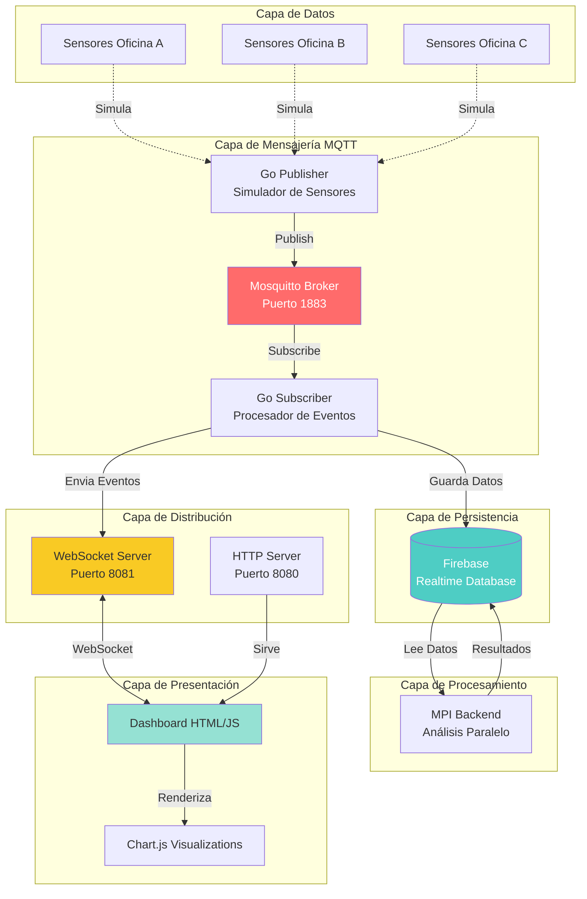
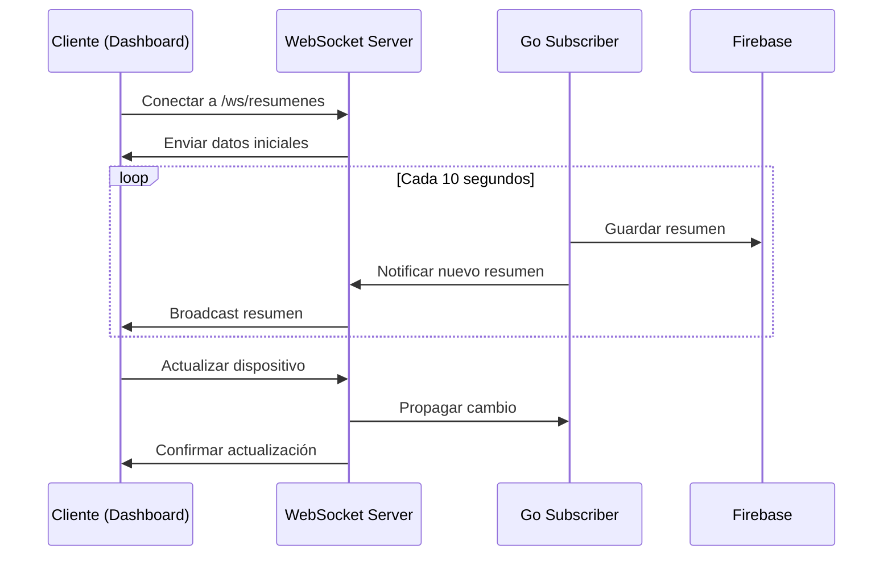
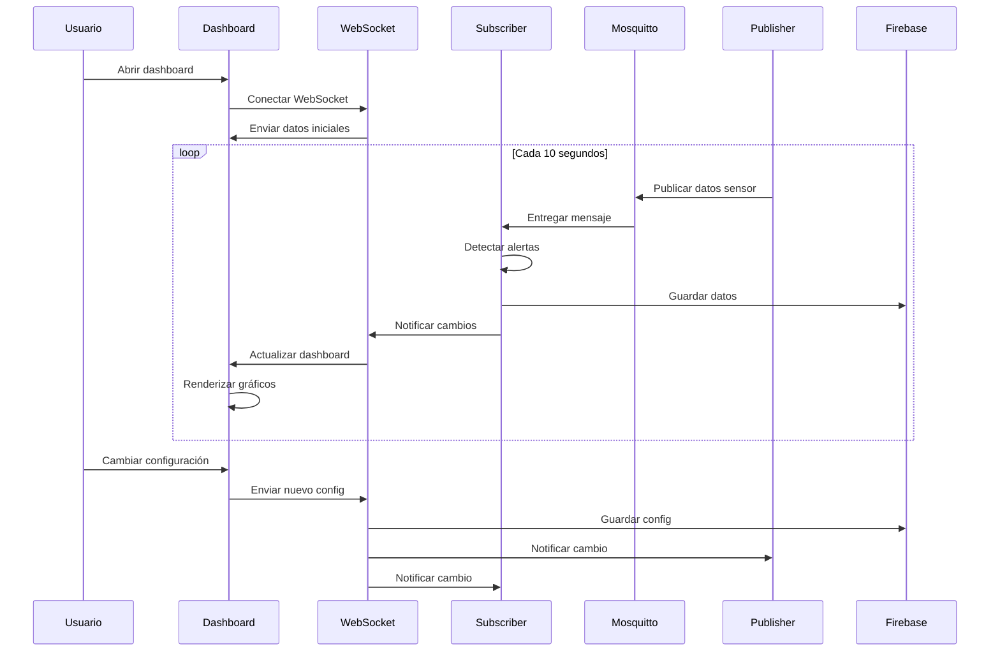

# Arquitectura del Sistema

## Vista General

El sistema está diseñado con una **arquitectura distribuida basada en microservicios**, donde cada componente tiene una responsabilidad específica y se comunica mediante protocolos estándar (MQTT, WebSocket, HTTP).



## Componentes Principales

### 1. Mosquitto MQTT Broker

**Propósito**: Broker de mensajes que implementa el protocolo MQTT.

**Características**:
- Puerto: `1883`
- Permite conexiones anónimas (configurado para desarrollo)
- Persistencia de mensajes habilitada
- Logs en `logs/mosquitto.log`

**Configuración** (`config/mosquitto.conf`):
```conf
listener 1883
allow_anonymous true
persistence true
persistence_location data/mosquitto/
max_connections 100
```

**Tópicos MQTT**:
```
oficinas/{id}/sensores
```

### 2. Go Publisher (Simulador de Sensores)

**Ubicación**: `mqtt/publisher/main.go`

**Propósito**: Simula sensores de múltiples oficinas publicando datos cada 10 segundos.

**Funcionalidades**:

#### Generación de Datos Realistas

```go
type DatosSensor struct {
    Oficina     string  `json:"oficina"`
    TiempoUnix  int64   `json:"timestamp"`
    Presencia   bool    `json:"presencia"`
    CorrienteA  float64 `json:"corriente_a"`
    Temperatura float64 `json:"temperatura"`
}
```

#### Lógica de Presencia

```go
func DetectarPresencia(t time.Time) bool {
    dia := t.Weekday()
    hora := float64(t.Hour()) + float64(t.Minute())/100.0
    return dia >= time.Monday && dia <= time.Friday &&
        hora >= params.HoraInicio && hora < params.HoraFin
}
```

#### Cálculo de Corriente

La corriente se calcula basándose en:
- **Consumo base**: 0.5-3.0 A (equipos siempre encendidos)
- **Luces**: +3.0 A (si hay presencia y están encendidas)
- **Aire acondicionado**: +10.0 A (si temperatura > umbral y está encendido)
- **Consumo adicional**: +1.0-7.0 A (equipos varios)

```go
func CalcularCorriente(oficina string, presencia bool, temperatura float64) float64 {
    base := 0.5 + rand.Float64()*(3.0-0.5)
    
    if presencia {
        if estado["luces"] {
            base += 3.0  // Luces
        }
        if temperatura >= params.UmbralTemperaturaAC && estado["aire"] {
            base += 10.0  // Aire acondicionado
        }
        base += 1.0 + rand.Float64()*(7.0-1.0)  // Equipos
    }
    
    return base
}
```

#### Sincronización con WebSocket

El Publisher escucha cambios en:
- `/ws/dispositivos` - Estado de luces y aire
- `/ws/oficinas` - Lista de oficinas activas
- `/ws/params` - Parámetros de configuración

### 3. Go Subscriber (Procesador de Eventos)

**Ubicación**: `mqtt/subscriber/main.go`

**Propósito**: Procesa mensajes MQTT, detecta alertas y genera resúmenes.

**Funcionalidades**:

#### Detección de Alertas

El sistema detecta 13 tipos de alertas:

| ID | Tipo | Descripción |
|----|------|-------------|
| 0 | Luces apagadas | Estado desactivado |
| 1 | Luces encendidas | Presencia detectada |
| 2 | Luces apagadas | Ausencia prolongada |
| 3 | Aire apagado | Estado desactivado |
| 4 | Aire encendido | Temperatura elevada |
| 5 | Aire apagado | Condiciones óptimas |
| 6 | Consumo anómalo | Corriente alta sin presencia |
| 7 | Corte de energía | Corriente en 0 |
| 8 | Sensor no responde | Sin datos por >60s |
| 9 | Alerta de corriente | Consumo > umbral |
| 10 | Oficina agregada | Nueva oficina |
| 11 | Oficina eliminada | Oficina removida |
| 12 | Config modificada | Parámetros cambiados |

#### Generación de Resúmenes

Cada 60 segundos, se genera un resumen por oficina:

```go
type Resumen struct {
    Timestamp       int64   `json:"timestamp"`
    CorrienteA      float64 `json:"corriente_a"`       // Promedio
    ConsumoKvh      float64 `json:"consumo_kvh"`       // Período actual
    ConsumoTotalKvh float64 `json:"consumo_total_kvh"` // Acumulado
    MinTemp         float64 `json:"min_temp"`
    MaxTemp         float64 `json:"max_temp"`
    TiempoPresente  int     `json:"tiempo_presente"`   // Segundos
    MontoEstimado   float64 `json:"monto_estimado"`    // Costo período
    MontoTotal      float64 `json:"monto_total"`       // Costo total
}
```

**Cálculo de Consumo**:

```go
// Potencia promedio (Watts)
promedioW := promedioAmp * voltaje

// Energía consumida (kWh)
duracionHoras := float64(duracionSegundos) / 3600.0
promedioKwh := promedioW * duracionHoras / 1000.0

// Costo
monto := promedioKwh * costoKwh
```

### 4. WebSocket Server

**Ubicación**: `socket.js`

**Propósito**: Distribuir datos en tiempo real a clientes conectados.

**Endpoints**:

```javascript
ws://localhost:8081/ws/resumenes      // Resúmenes de consumo
ws://localhost:8081/ws/avisos         // Alertas del sistema
ws://localhost:8081/ws/dispositivos   // Estado de dispositivos
ws://localhost:8081/ws/params         // Configuración
ws://localhost:8081/ws/oficinas       // Gestión de oficinas
```

**Flujo de Datos**:



### 5. Firebase Realtime Database

**Estructura de Datos**:

```
monitoreo_consumo/
├── configuracion/
│   ├── hora_inicio: 8.0
│   ├── hora_fin: 20.0
│   ├── umbral_temperatura_ac: 25.0
│   ├── umbral_corriente: 21.5
│   ├── voltaje: 220.0
│   └── costo_kwh: 0.25
├── tipos_avisos/
│   ├── 0: { motivo, detalle, impacto }
│   ├── 1: { motivo, detalle, impacto }
│   └── ...
├── oficinas/
│   ├── A/
│   │   ├── nombre: "Oficina A"
│   │   ├── sector: "Informatica"
│   │   ├── avisos/
│   │   │   └── {push_id}: { timestamp, id_tipo, adicional }
│   │   ├── resumenes/
│   │   │   └── {push_id}: { timestamp, corriente_a, consumo_kvh, ... }
│   │   └── estados_dispositivos/
│   │       ├── aire: true
│   │       └── luces: true
│   ├── B/
│   └── C/
```

### 6. MPI Backend (Procesamiento Paralelo)

**Ubicación**: `backend/mpi/mpi_analysis.c`

**Propósito**: Análisis avanzado de eficiencia energética usando procesamiento paralelo.

**Funcionalidades**:

#### Análisis de Eficiencia

```c
void analyze_energy_data(OfficeData *offices, int office_count, 
                         AnalysisResult *result, int rank, int size) {
    // Dividir datos entre procesos
    int chunk_size = office_count / size;
    
    // Cada proceso calcula métricas locales
    for (int i = start_index; i < end_index; i++) {
        local_total_consumption += offices[i].consumption;
        double efficiency = calculate_efficiency(offices[i]);
        // ...
    }
    
    // Reducir resultados con MPI_Reduce
    MPI_Reduce(&local_total, &result->total, 1, MPI_DOUBLE, MPI_SUM, 0, MPI_COMM_WORLD);
}
```

#### Clustering de Consumo

K-means paralelo para clasificar oficinas en 3 grupos:
- **Bajo consumo**: < 0.5 kWh
- **Consumo medio**: 0.5-2.0 kWh
- **Alto consumo**: > 2.0 kWh

### 7. Dashboard Frontend

**Ubicación**: `resources/template.html`

**Tecnologías**:
- HTML5 + CSS3
- JavaScript vanilla
- Chart.js para visualizaciones
- WebSocket API

**Características**:
- Tema claro/oscuro
- Gráficos en tiempo real
- Control de dispositivos
- Gestión de oficinas
- Configuración de parámetros

## Patrones de Diseño

### Publisher-Subscriber (MQTT)

Desacopla productores de datos (Publisher) de consumidores (Subscriber) mediante un broker central.

**Ventajas**:
- Escalabilidad
- Bajo acoplamiento
- Resiliencia

### WebSocket para Tiempo Real

Conexión bidireccional persistente para actualizaciones instantáneas.

**Ventajas**:
- Baja latencia
- Eficiencia (sin polling)
- Comunicación bidireccional

### Procesamiento Paralelo (MPI)

Divide análisis pesados entre múltiples nodos.

**Ventajas**:
- Alto rendimiento
- Escalabilidad horizontal
- Aprovechamiento de múltiples cores

## Flujo de Ejecución Completo



## Próximos Pasos

- [Instalación](/guide/installation) - Configura el sistema
- [Ejecución](/guide/running) - Aprende a usar el script de control
- [API WebSocket](/api/websocket) - Referencia técnica de endpoints
