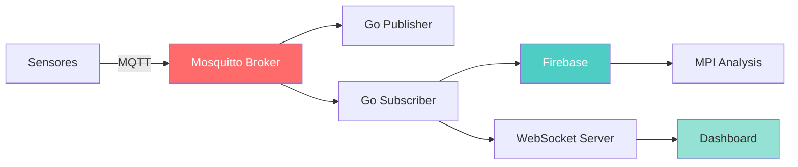

# Introducción al Sistema de Monitoreo de Consumo Eléctrico

## ¿Qué es este sistema?

El **Sistema de Monitoreo de Consumo Eléctrico** es una plataforma distribuida en tiempo real diseñada para monitorear, analizar y optimizar el consumo energético en múltiples oficinas o espacios. Combina tecnologías modernas de mensajería, procesamiento paralelo y visualización de datos para proporcionar información accionable sobre el uso de energía.

## Características Principales

### <i class="fas fa-sync-alt"></i> Monitoreo en Tiempo Real

El sistema recopila datos cada **10 segundos** de cada oficina, incluyendo:

- **Corriente eléctrica** (Amperes)
- **Temperatura ambiente** (°C)
- **Detección de presencia** (boolean)
- **Estado de dispositivos** (luces, aire acondicionado)

### <i class="fas fa-chart-bar"></i> Análisis Inteligente

- **Resúmenes cada 60 segundos**: Consumo promedio, temperaturas min/max, tiempo de presencia
- **Detección automática de alertas**: Consumo anómalo, cortes de energía, sensores sin respuesta
- **Cálculo de costos**: Estimación de costos basada en consumo y tarifa configurable
- **Procesamiento paralelo MPI**: Análisis de eficiencia energética y clustering de consumo

### <i class="fas fa-bullseye"></i> Gestión Dinámica

- **Agregar/eliminar oficinas** en tiempo real
- **Configuración de parámetros** (horarios, umbrales, costos)
- **Control de dispositivos** (encender/apagar luces y aire acondicionado)

## Arquitectura de Alto Nivel



## Stack Tecnológico

### Backend

| Componente | Tecnología | Propósito |
|------------|-----------|-----------|
| **Message Broker** | Mosquitto (MQTT) | Comunicación pub/sub entre componentes |
| **Publisher** | Go + Paho MQTT | Simulación de datos de sensores |
| **Subscriber** | Go + Paho MQTT | Procesamiento de mensajes y lógica de negocio |
| **WebSocket Server** | Node.js + ws | Distribución de datos en tiempo real |
| **HTTP Server** | Node.js + http | Servir dashboard frontend |
| **Database** | Firebase Realtime DB | Persistencia de datos |
| **Parallel Processing** | C + OpenMPI | Análisis avanzado de eficiencia |

### Frontend

| Tecnología | Uso |
|-----------|-----|
| **HTML5/CSS3/JavaScript** | Estructura y lógica del dashboard |
| **Chart.js** | Gráficos de consumo en tiempo real |
| **WebSocket API** | Conexión bidireccional con servidor |

## Flujo de Datos Completo

### 1. Generación de Datos (Publisher)

```go
// Cada 10 segundos
datos := DatosSensor{
    Oficina:     "A",
    Timestamp:   time.Now().Unix(),
    Presencia:   true,
    CorrienteA:  12.5,
    Temperatura: 24.3,
}
```

### 2. Publicación MQTT

```
Topic: oficinas/A/sensores
Payload: {"oficina":"A","timestamp":1701648000,"presencia":true,"corriente_a":12.5,"temperatura":24.3}
```

### 3. Procesamiento (Subscriber)

El Subscriber:
- Recibe el mensaje MQTT
- Detecta alertas (consumo elevado, ausencia de corriente, etc.)
- Acumula datos para resúmenes
- Guarda en Firebase

### 4. Distribución (WebSocket)

```javascript
// Servidor envía a todos los clientes conectados
ws.send(JSON.stringify({
    tipo: 'resumenes',
    data: {
        A: { corriente_a: 12.5, consumo_kvh: 2.75, ... },
        B: { corriente_a: 8.2, consumo_kvh: 1.80, ... }
    }
}));
```

### 5. Visualización (Dashboard)

El dashboard recibe los datos y actualiza gráficos en tiempo real.

## Casos de Uso

### 1. Monitoreo de Oficinas

**Escenario**: Una empresa quiere monitorear el consumo de 3 oficinas.

**Solución**: El sistema recopila datos de cada oficina y muestra:
- Consumo actual y total
- Costos estimados
- Temperaturas
- Tiempo de ocupación

### 2. Detección de Anomalías

**Escenario**: Se detecta consumo elevado sin presencia.

**Solución**: El sistema genera una alerta automática:
```json
{
  "timestamp": 1701648000,
  "id_tipo": "6",
  "adicional": "Consumo: 15.2 A sin presencia detectada"
}
```

### 3. Optimización Energética

**Escenario**: Analizar patrones de consumo para reducir costos.

**Solución**: El backend MPI procesa datos históricos y genera:
- Clustering de oficinas por consumo
- Métricas de eficiencia
- Recomendaciones de optimización

## Ventajas del Sistema

<i class="fas fa-check-circle"></i> **Escalable**: Agregar oficinas dinámicamente sin reiniciar  
<i class="fas fa-check-circle"></i> **Tiempo Real**: Visualización instantánea de cambios  
<i class="fas fa-check-circle"></i> **Distribuido**: Componentes independientes y resilientes  
<i class="fas fa-check-circle"></i> **Inteligente**: Detección automática de anomalías  
<i class="fas fa-check-circle"></i> **Flexible**: Configuración de parámetros en caliente  
<i class="fas fa-check-circle"></i> **Eficiente**: Procesamiento paralelo para análisis pesados  

## Próximos Pasos

Ahora que entiendes qué es el sistema, explora:

- [Arquitectura Detallada](/guide/architecture) - Profundiza en cada componente
- [Instalación](/guide/installation) - Configura el sistema paso a paso
- [Ejecución](/guide/running) - Aprende a usar el script de control

---

<div class="tip custom-block">
  <p class="custom-block-title"><i class="fas fa-lightbulb"></i> ¿Necesitas ayuda?</p>
  <p>Consulta la <a href="/api/websocket">Referencia de API</a> para detalles técnicos de cada endpoint.</p>
</div>
